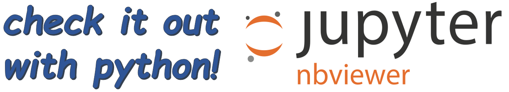

====
c3dp
====

.. image:: https://anaconda.org/fi0/c3dp/badges/version.svg
        :target: https://anaconda.org/fi0/c3dp

.. image:: https://anaconda.org/fi0/c3dp/badges/platforms.svg
        :target: https://anaconda.org/fi0/c3dp

.. image:: https://img.shields.io/travis/fahima-islam/c3dp.svg
        :target: https://travis-ci.org/fahima-islam/c3dp

.. image:: https://img.shields.io/pypi/v/c3dp.svg
        :target: https://pypi.python.org/pypi/c3dp

.. image:: https://readthedocs.org/projects/c3dp/badge/?version=latest
        :target: https://c3dp.readthedocs.io/en/latest/?badge=latest
        :alt: Documentation Status

Automated design of 3D printed collimator optimized for high pressure diffraction
---------------------------------------------------------------------------------
Features
--------
 description of the simulation
* Simulation of the the diffractometer
* Simulation of the pressure cells
* Optimization of  the collimator for the given pressure cell
* Produced the .stl or .scad file of the collimator to be 3D printed
* Produced the gauge volume of the collimator

.. image:: https://raw.githubusercontent.com/Fahima-Islam/c3dp/master/figures/flow.png
   :width: 300pt

Usage
--------

